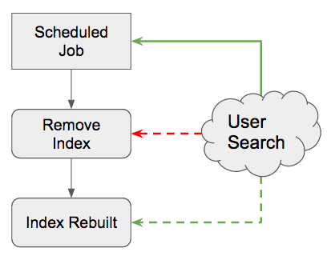
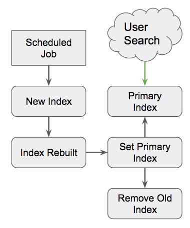

# Elasticsearch Index Rotator

A library to enable you to safely rotate indexes with no downtime to end users.

[](https://travis-ci.org/zumba/elasticsearch-index-rotator)

### Why would I use this?

In many situations, Elasticsearch is used as an ephemeral datastore used to take structured or relational data and make it fast to search on that data. Often this is achieved via scheduled jobs that read data from a permanent datastore (such as MySQL or Postgres) and translate it into an Elasticsearch index.

In many cases, rebuilding an index requires a clean slate so that the entire index is rebuilt. How do you do this without interrupting end users searching on that index? The answer is a rotating index.



> Here the user's search is fully disrupted when the index is first removed, and only partially available while the index is being rebuilt. While the index is being rebuilt, users get incomplete data.



> Here the user's search is never disrupted because we construct a new index and after it is built/settled, we change the what index to search by the client.

## Installation

```
composer require zumba/elasticsearch-index-rotate
```

## Usage

#### Example Search

```php
<?php

$client = new \Elasticsearch\Client();
$indexRotator = new \Zumba\ElasticsearchRotator\IndexRotator($client, 'pizza_shops');
$client->search([
	'index' => $indexRotator->getPrimaryIndex(), // Get the current primary!
	'type' => 'shop',
	'body' => [] //...
]);
```

#### Example Build

```php
<?php

$client = new \Elasticsearch\Client();
$indexRotator = new \Zumba\ElasticsearchRotator\IndexRotator($client, 'pizza_shops');
// Build your index here
$newlyBuiltIndexName = 'my_new_built_index_name';
$indexRotator->copyPrimaryIndexToSecondary();
$indexRotator->setPrimaryIndex($newlyBuiltIndexName);
// optionally remove the old index right now
$indexRotator->deleteSecondaryIndices();
```

#### All together

```php
<?php

use \Elasticsearch\Client;
use \Zumba\ElastsearchRotator\IndexRotator;

class MySearchIndex {

	const INDEX_PREFIX = 'pizza_shops';

	public function __constructor(\Elasticsearch\Client $client) {
		$this->client = $client;
	}

	public function search($params) {
		$indexRotator = new IndexRotator($this->client, static::INDEX_PREFIX);
		return $client->search([
			'index' => $indexRotator->getPrimaryIndex(), // Get the current primary!
			'type' => 'shop',
			'body' => $params
		]);
	}

	public function rebuildIndex() {
		$indexRotator = new IndexRotator($client, static::INDEX_PREFIX);
		$newlyBuiltIndexName = $this->buildIndex($client);
		$indexRotator->copyPrimaryIndexToSecondary();
		$indexRotator->setPrimaryIndex($newlyBuiltIndexName);
		// optionally remove the old index right now
		$indexRotator->deleteSecondaryIndices();
	}

	private function buildIndex(\Elasticsearch\Client $client) {
		$newIndex = static::INDEX_PREFIX . '_' . time();
		// get data and build index for `$newIndex`
		return $newIndex;
	}

}
```

## Using Strategies

You can now customize the strategy of getting/setting the primary index. By default, the `ConfigurationStrategy` is employed,
however we have also included an `AliasStrategy`. The main difference is when `setPrimaryIndex` is called, instead of creating an entry
in the configuration index, it adds an alias (specified by `alias_name` option) on the specified index and deletes all other aliases
for the old primary indices (specified by `index_pattern`).

#### Using the `AliasStrategy`

```php
<?php

$client = new \Elasticsearch\Client();
$indexRotator = new \Zumba\ElasticsearchRotator\IndexRotator($client, 'pizza_shops');
$aliasStrategy = $indexRotator->strategyFactory(IndexRotator::STRATEGY_ALIAS, [
	'alias_name' => 'pizza_shops',
	'index_pattern' => 'pizza_shops_*'
]);
// Build your index here
$newlyBuiltIndexName = 'pizza_shops_1234102874';
$indexRotator->copyPrimaryIndexToSecondary();
$indexRotator->setPrimaryIndex($newlyBuiltIndexName);

// Now that the alias is set, you can search on that alias instead of having to call `getPrimaryIndex`.
$client->search([
	'index' => 'pizza_shops',
	'type' => 'shop',
	'body' => [] //...
])
```

Since the alias (`pizza_shops`) is mapped to the primary index (`pizza_shops_1234102874`), you can use the alias directly in your client application rather than having to call `getPrimaryIndex()` on the `IndexRotator`. That being said, calling `getPrimaryIndex` won't return the alias, but rather the index that it is aliasing. The secondary entries in the configuration index are still used and reference the actual index names, since the alias can be updated at any time and there wouldn't be a reference to remove the old one.
